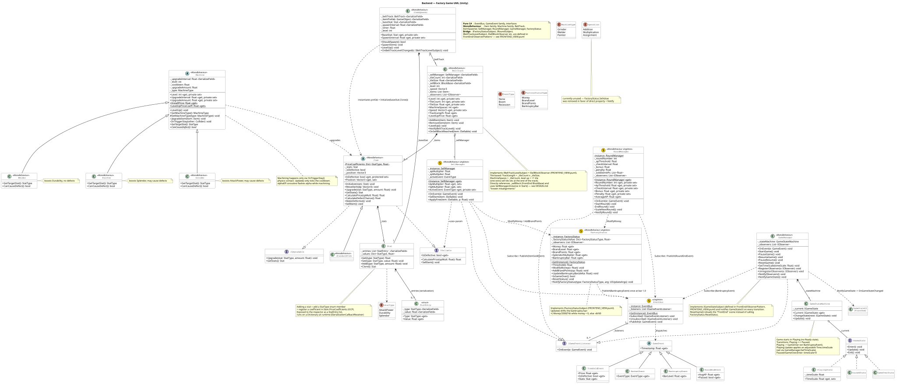
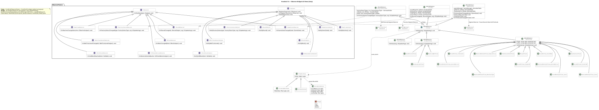
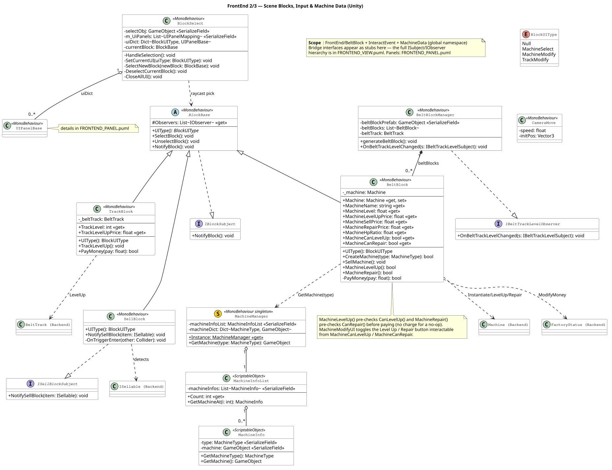
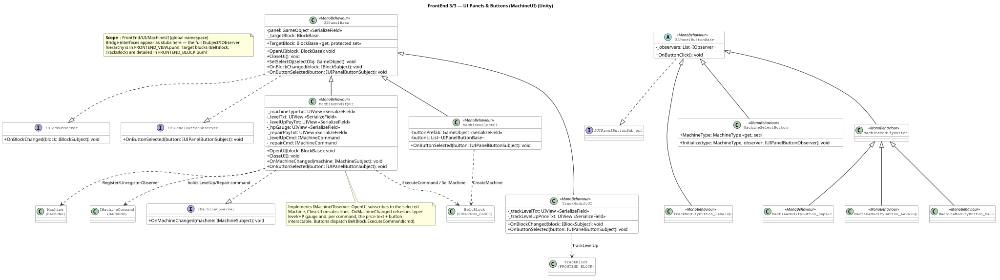

# OOPS-Project

A factory simulation game built with Unity. Items flow along a conveyor belt;
you place machines to process them and raise their stats (Attack Power,
Durability, Splendor), then sell them for profit and reinvest in better belts
and machines to hit each round's target. If the bankruptcy gauge fills up, it's
game over.

## Download & Play

Prebuilt **Windows** builds are published on the
[Releases page](https://github.com/dotori235/OOPS-Project/releases).

1. Download `OOPS_FactorySimulation_Windows.zip` from the
   [latest release](https://github.com/dotori235/OOPS-Project/releases/latest)
   (currently [v0.1.0](https://github.com/dotori235/OOPS-Project/releases/tag/v0.1.0)).
2. Extract the zip anywhere.
3. Run `OOPS_FactorySimulation.exe`.

Then see [Controls](#controls) and [How to Play](#how-to-play) below.

> Want to build or modify the game yourself? See [Getting Started](#getting-started).

## Tech

- Unity 6.3 LTS (6000.3.x)
- C#

## Getting Started

1. Open the project in Unity 6.3 LTS.
2. Open the scene `Assets/Scenes/FrontEnd.unity` (build index 0).
3. Press **Play**.

## Core Loop

```
spawn item → belt moves it → machine processes (boosts a stat) → sell → round payout → upgrade
```

## Controls

| Input | Action |
|---|---|
| **Left mouse click** | Select a block (machine slot / track / seller). Opens its panel. |
| Click the same block again / click empty space | Deselect and close the panel. |
| **A** / **D** | Move the camera left / right. |
| **Space** | Reset the camera to its starting position. |
| Pause / Resume button | Toggle pause (also controls game speed). |
| Time-scale slider | Adjust game speed while playing. |
| Restart button | Reload the scene and start over. |

Clicking a block opens a context panel:

- **Empty machine slot** → *Machine Select* panel: install a Grinder, Welder, or Painter.
- **Slot with a machine** → *Machine Modify* panel: see the HP gauge and prices, then **Level Up**, **Repair**, or **Sell** the machine. The Level Up / Repair buttons grey out when the action isn't currently possible.
- **Track block** → *Track Modify* panel: level the belt up (adds one more machine tile).
- **Seller (end of belt)** → no panel; it's where finished items are sold automatically.

## How to Play

### Machines

Place a machine on a belt tile. As an item passes over it, the machine boosts one stat:

| Machine | Boosts | Can cause defects |
|---|---|---|
| **Grinder** | Attack Power | Yes |
| **Welder** | Durability | No |
| **Painter** | Splendor | Yes |

- A **defective** item is worth no income — selling it instead applies a **fine** (proportional to its value).
- Leveling a machine up increases how much it boosts per item and how fast it works.

### Machine durability (HP)

- Every item a machine processes **wears its HP down** — less at higher levels, and **no wear once the machine reaches level 5** (so a maxed machine runs maintenance-free).
- At **0 HP the machine stops processing**. If HP falls below the upgrade threshold, you **can't level it up until you Repair** it.
- **Repair** restores HP to full for a fixed cost.

### Belt & track

- The belt has a fixed number of machine tiles plus a **seller tile** at the end.
- Leveling the **track** up adds another machine tile, giving you more processing slots.

### Rounds

- Each round sets a **target average Attack Power** and a time limit.
- When the round ends, if the average AP of the items you sold meets the target you earn a **reward**; if not, you take a **penalty**.

### Money & game over

- Money may go **negative** (overdraft). While money is below zero, the **bankruptcy gauge** rises over time; while you're in the black it slowly recovers.
- When the bankruptcy gauge reaches **100%, it's game over**.

### Economy (default costs)

| Action | Cost |
|---|---|
| Install machine | 200 |
| Level up machine | level × 100 |
| Repair machine | 50 (fixed) |
| Level up track | level × 500 |

## Project Structure

| Path | Contents |
|---|---|
| `Assets/Scripts/Backend/` | Game logic (stats, belt, machines, selling, rounds, game-flow FSM, machine commands) |
| `Assets/Scripts/FrontEnd/` | UI, input, and scene blocks (wired to the backend via the Observer pattern) |
| `Assets/Scripts/DESIGN.md` | Design decisions and layer architecture |
| `docs/uml/` | Auto-generated UML (SVG/PNG) |

## Design Docs

- [DESIGN.md](Assets/Scripts/DESIGN.md) — layer structure and design decisions
- [UML.pdf](UML.pdf) — all diagrams combined into one vector PDF

## UML

Pushing changes to the `.puml` sources triggers a GitHub Actions workflow that
regenerates the diagrams below.

### Backend



### FrontEnd 1/3 — Observer bridge & UI widgets



### FrontEnd 2/3 — Scene blocks · input · machine data



### FrontEnd 3/3 — UI panels & buttons


